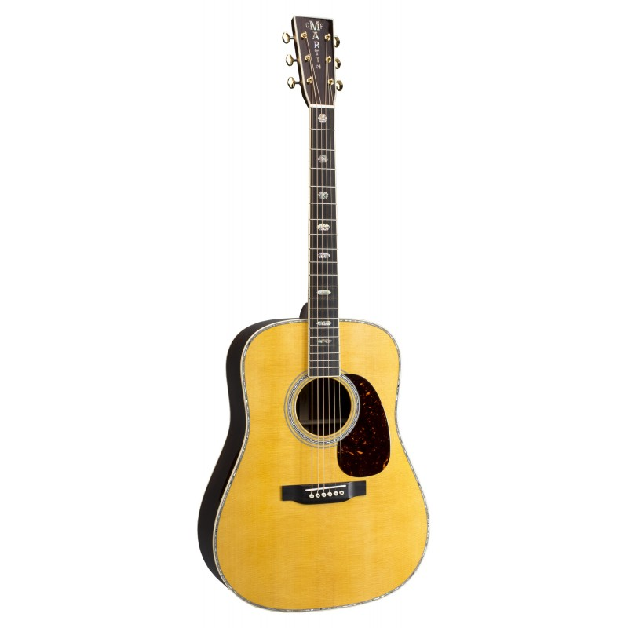

#Guitar Presentation
>Presentation as part of the homework of the Acodemy_QA project
##MARTIN D-41
###Table of contents
##### 1. Description
##### 2. Product details
##### 3. Image
##### 4. Link
####Description
**Inlaid in stunning abalone pearl and appointed with gold tuners, it's more than a Dreadnought: it's an heirloom. Premium East Indian rosewood and Sitka spruce combined with hand-carved scalloped bracing to produce rich, powerful, complex tone. Also available in Sunburst and Ambertone finish.**
####Product details
**String Type: Steel Number of Strings: 6 Body Shape: Dreadnought Left-/Right-handed: Right-handed Color: Natural, Aging Toner Finish: Gloss Top Wood: Sitka Spruce Back & Sides Wood: East Indian Rosewood Body Bracing: Scalloped Forward Shifted X-bracing Binding: Antique White Neck Wood: Mahogany Neck Shape: Modified Low Oval, High Performance Taper Radius: 16" Fingerboard Material: Ebony Fingerboard Inlay: Abalone Reduced Hexagon Number of Frets: 20 Scale Length: 25.4" Tuning Machines: Gold Open Gear Bridge Material: Ebony Nut/Saddle Material: Bone/Bone Nut Width: 1.75" Strings: Lifespan 2.0 92/8 Phosphor Bronse, .013-.056 Case Included: Hardshell Case Manufacturer Part Number: 10Y18D41**
####Image

####Link
**https://www.muzpro.eu/en/guitars-and-bass-guitars/acoustic-guitars/acoustic-guitars/134481-martin-d-41.html**